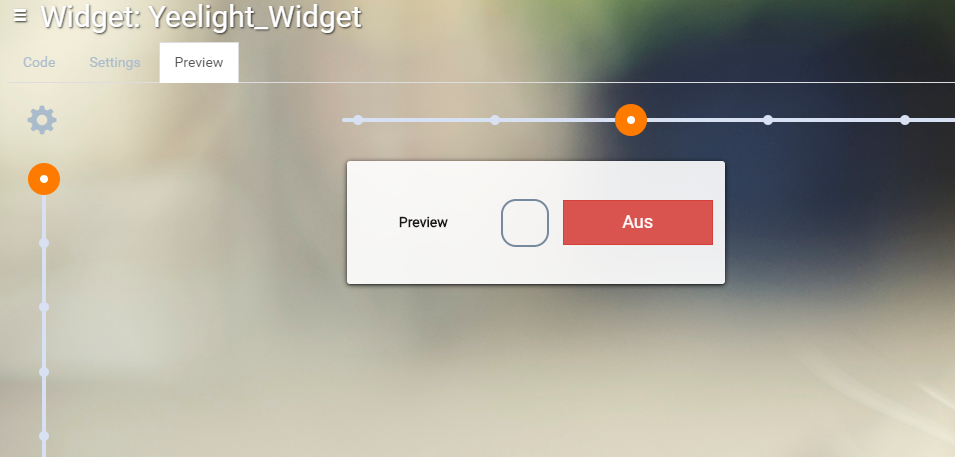
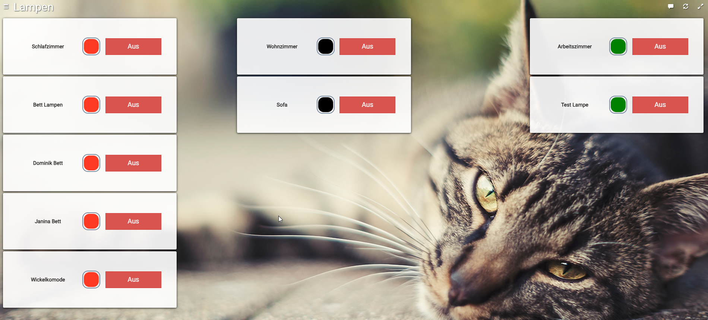
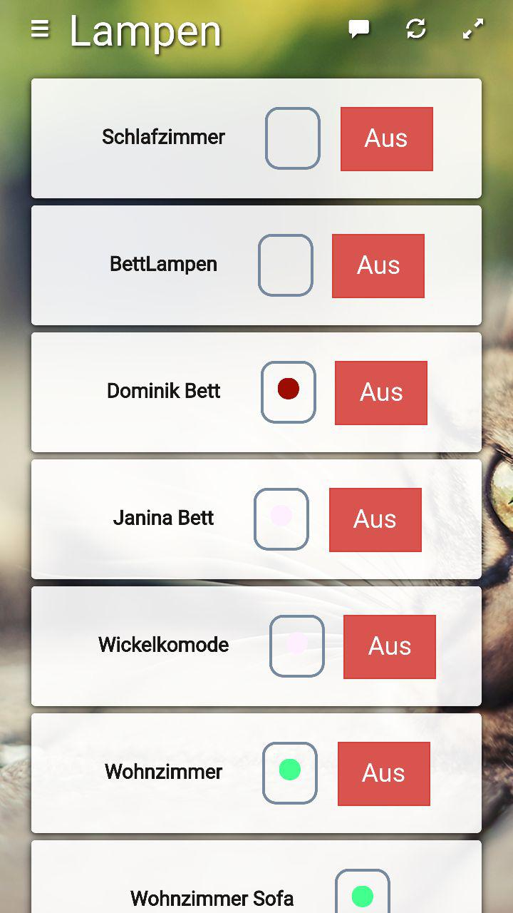

# Yeelight control widget for HABPanel
This widget can control your xiaomi yeelights. You are able to choose a color and you can turn on / off your light.
Its also possible to use this widget for lights in a group. 
This is my first widget and its quit simple.
 
View from the editor: 

Example view for your dashboard (german language): 

Example of the mobile view for your dashboard (german language): 

 
## Features
* Control your Xiaomi Yeelight (on/off)
* Pick a color for your light
* Name, Color picker and on/off switch in one widget
* multi language (Thanks to Andreas Kuhn for this great [manual](https://community.openhab.org/t/habpanel-in-german-using-map-transformation/27818/6))

## Installation

Use the widget gallery in HABPanel to access this repository (you might be reading this in it right now!) 
and click the big green Import Widget button.

## Configuration

There are three settings to use this widget: 
 
**Display name:** 
Is used for the naming the yeelight in your home. 
 
**item_color:** 
Its the item (type Color) to control the color of your yeelight. 
 
**item_switch:** 
Its the item (type Switch) to control the state of your yeelight. 